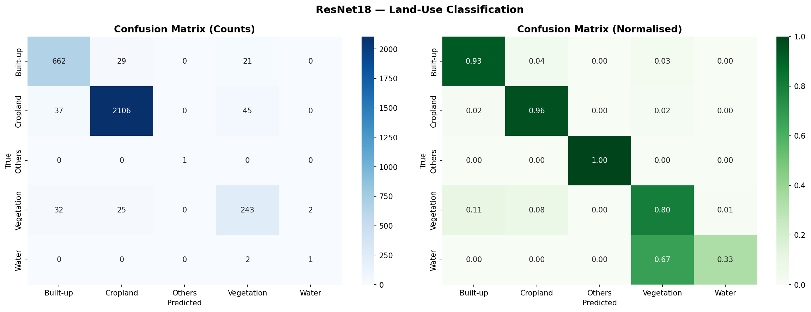
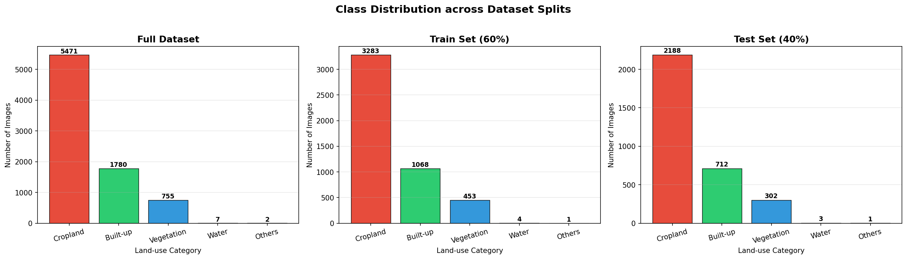

# AI_for_Sustainability_SRIP_2026

# SRIP 2026 
## EARTH OBSERVATIOIN
## AI for Sustainability

##  OVERVIEW
An end-to-end pipeline for spatial gridding and land cover classification of the Delhi-NCR region using Sentinel-2 satellite imagery and ESA WorldCover 2021 data.

Built as part of the SRIP 2026 Earth Observation assignment 
commissioned to identify land use patterns and pollution 
sources across the Delhi Airshed.

---

## Repository Structure
```
AI_for_Sustainability_SRIP_2026/
│
├── notebook/
│   └── earth_observation_pipeline.ipynb
│
├── results/
│   ├── confusion_matrix.png
│   ├── class_distribution.png
│   ├── training_curves.png
│   └── delhi_ncr_map.html
│
├── requirements.txt
└── README.md
```


## Dataset
Provided by SRIP 2026 organizers. Not included in this repo due to size.

| File | Description |
|---|---|
| `delhi_ncr_region.geojson` | Delhi-NCR boundary shapefile |
| `rgb/` | Sentinel-2 RGB image patches (128×128, 10m/pixel) |
| `land_cover.tif` | ESA WorldCover 2021 raster (10m resolution) |


## Pipeline

### Q1 — Spatial Reasoning & Data Filtering
- Plot the Delhi-NCR shapefile using matplotlib and overlay a 60×60 km uniform grid (2 marks)
- Filter satellite images whose center coordinates fall inside the region. (1 mark)
- Report the total number of images before and after filtering. (1 mark)


### Q2 — Label Construction & Dataset Preparation
-For each image, extract the  128×128 corresponding land-cover patch from land_cover.tif using its center coordinate (2 marks)
- Assign the image label using the dominant (mode) land-cover class. (1 mark)
- Map ESA class codes to simplified land-use categories (e.g., Built-up, Vegetation, Water, Cropland, Others). (1 mark)
- Perform a 60/40 train-test split randomly and visualize class distribution (2 mark)


| ESA Code | Category |
|---|---|
| 10, 20, 30, 95 | Vegetation |
| 40 | Cropland |
| 50 | Built-up |
| 80 | Water |
| 60, 70, 90, 100 | Others |

- Performed stratified 60/40 train-test split

| Class | Train | Test |
|---|---|---|
| Cropland | 3283 | 2188 |
| Built-up | 1068 | 712 |
| Vegetation | 453 | 302 |
| Water | 4 | 3 |
| Others | 1 | 1 |

### Q3 — Model Training & Supervised Evaluation
- Train a CNN model (e.g., ResNet18 or a simple custom CNN) for land-use classification. (2 marks)
- Evaluate using accuracy and F1-score. (2 marks)
- Display a confusion matrix and briefly interpret the results. (1 mark)

---

## Results

| Metric | Score |
|---|---|
| Test Accuracy | 93.98% |
| Weighted F1 | 0.94 |
| Macro F1 | 0.80 |

### Confusion Matrix


### Class Distribution



##  AI Acknowledgement
AI assistance (Claude by Anthropic) was used to help write 
and debug portions of this code. All code has been reviewed 
and understood by me.
